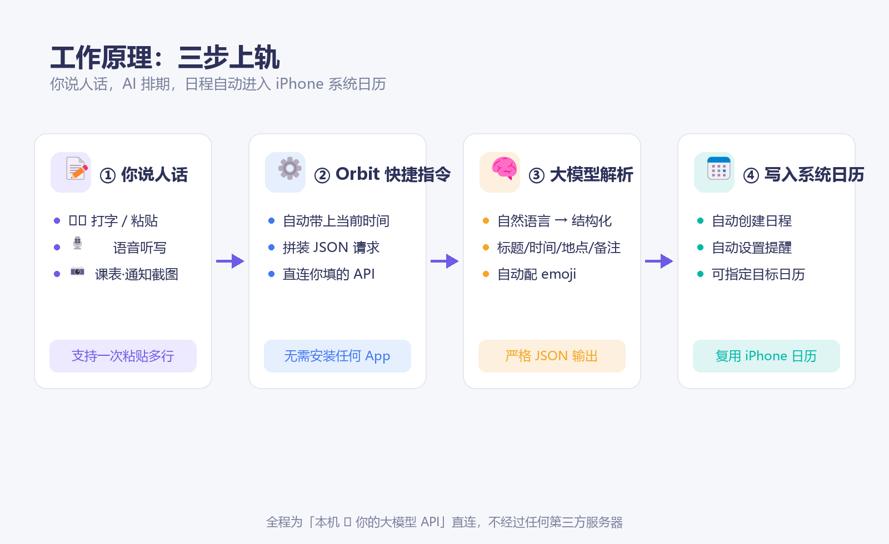
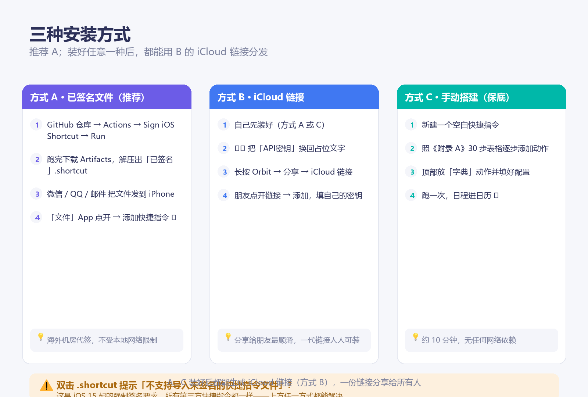
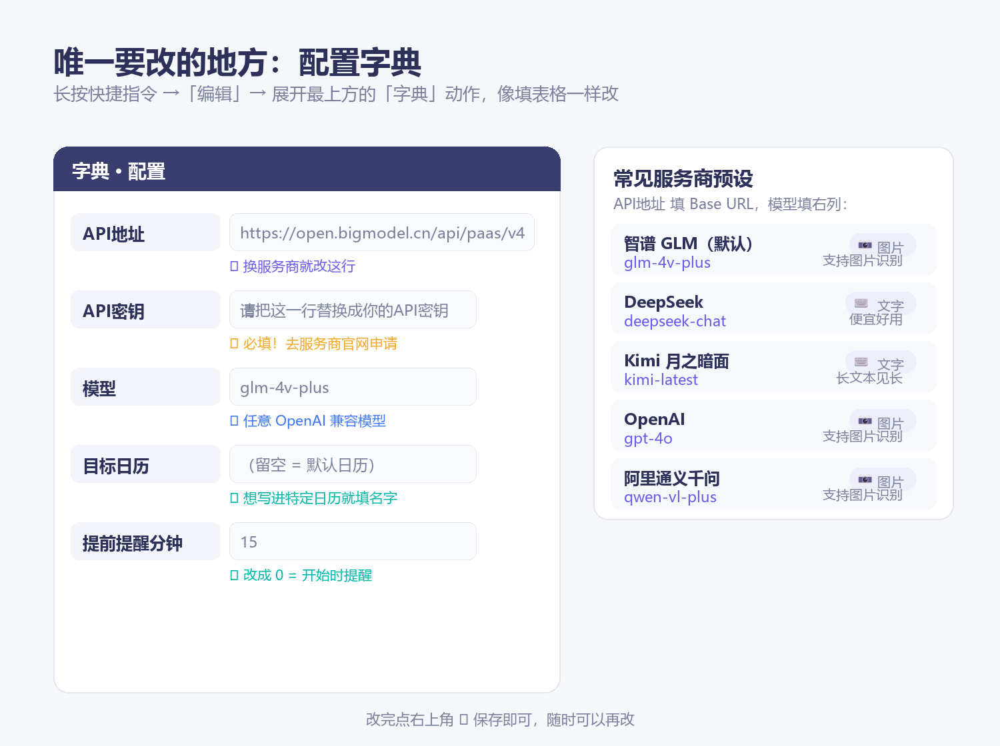
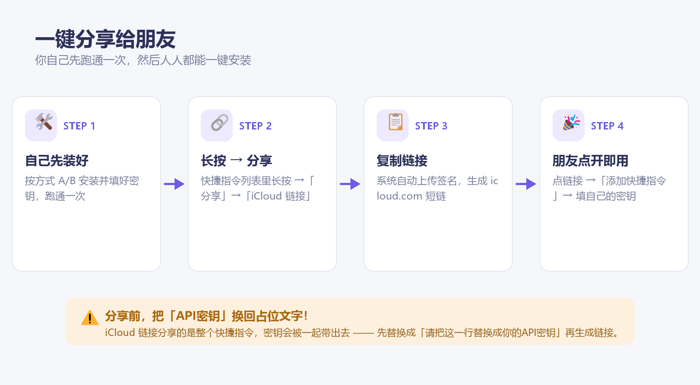

# 🪐 Orbit·轨道 日程助手 —— iOS 快捷指令版 · 使用说明书


> 哈喽，欢迎使用 **Orbit·轨道 · 快捷指令版** 🎉
>
> 侧载 App 太麻烦？这一版不需要电脑、不需要开发者模式、不需要每 7 天重签——
> **一个已签名文件或一条 iCloud 链接，点开即用**，功能完整保留：AI 识别日程、批量录入、自动写进 iPhone 系统日历。
>
> 这份教程会带你完成安装、配置和第一次识别。跟着步骤来就好，遇到问题可以直接翻到第八节「常见问题」。

---

## 一、这是什么？

一句话：**像发微信一样描述你的计划，AI 把它们变成日历日程。**



- **三种输入**：⌨️ 打字或粘贴（支持一次粘贴多行）· 🎙️ 语音听写 · 📷 识别课表 / 会议通知截图
- **AI 解析**：调用云端大模型（智谱 GLM / DeepSeek / Kimi / OpenAI / 任意 OpenAI 兼容接口），把自然语言变成结构化日程
- **批量录入**：多行日程一次粘贴，逐项识别、逐项建卡
- **写入系统日历**：自动推算年份、星期、时长，配上 emoji，自动设置提醒
- **不装 App**：纯快捷指令实现，复用 iPhone 自带日历

| | App 完整版（侧载） | 快捷指令版 ⭐ |
|---|---|---|
| 安装门槛 | 电脑 + 开发者模式 + 7 天重签 | **点一下链接** |
| 输入方式 | 文字 / 语音 / 图片 | 文字 / 语音 / 图片 |
| 聊天式日程卡片管理 | ✅ | ❌（可用系统日历编辑替代） |
| 多模型自定义 | ✅ | ✅（改配置字典即可） |
| 分享给朋友 | 需各自侧载 | **转发一条链接** |

---

## 二、准备工作：领一枚 API 密钥（约 5 分钟）

AI 识别需要一把「钥匙」。**推荐智谱 GLM**：新用户有免费额度，国内直连无需科学上网，而且默认模型 `glm-4v-plus` 支持图片识别。

1. 打开 [open.bigmodel.cn](https://open.bigmodel.cn) → 注册 / 登录（手机号即可）
2. 右上角「控制台」→ 左侧「API Keys」（或直接访问 [bigmodel.cn/usercenter/apikeys](https://bigmodel.cn/usercenter/apikeys)）
3. 「添加新的 API Key」→ 复制生成的一长串字符（**只显示一次，先存到备忘录**）

<details><summary>👉 想用其他服务商？（DeepSeek / Kimi / OpenAI / 通义）</summary>

| 服务商 | API地址（Base URL） | 推荐模型 | 支持图片 |
|---|---|---|---|
| 智谱 GLM（默认） | `https://open.bigmodel.cn/api/paas/v4` | `glm-4v-plus` | ✅ |
| DeepSeek | `https://api.deepseek.com/v1` | `deepseek-chat` | ❌ |
| Kimi 月之暗面 | `https://api.moonshot.cn/v1` | `kimi-latest` | ❌ |
| OpenAI | `https://api.openai.com/v1` | `gpt-4o` | ✅ |
| 阿里通义千问 | `https://dashscope.aliyuncs.com/compatible-mode/v1` | `qwen-vl-plus` | ✅ |

各家密钥获取：官网 → 开放平台 → API Keys → 创建。选了不支持图片的模型时，请用文字 / 语音方式输入。
</details>

---

## 三、安装（三种方式，按推荐顺序）



> ⚠️ **为什么不能直接双击 `.shortcut` 文件导入？** iOS 15 起，苹果要求快捷指令
> 文件必须带有 Apple 官方数字签名（CMS 签名）才允许导入，直接打开会提示
> 「不支持导入未签名的快捷指令文件」。这不是 Orbit 的问题，所有第三方快捷指令
> 都一样。下面三条路，任选其一。

### 方式 A · 已签名文件（推荐，电脑点几下搞定）

1. 电脑上：把本项目推送（或更新）到 GitHub → 仓库页 **Actions** → 左侧
   **Sign iOS Shortcut** → **Run workflow** → 等约 1 分钟跑完
2. 点进这次运行 → 底部 **Artifacts** 下载 `Orbit-shortcut-signed` → 解压得到
   **Orbit轨道日程助手-已签名.shortcut**（GitHub 海外机房代为签名，绕开本地网络限制）
3. 把文件发到 iPhone（微信「文件传输助手」/ QQ / 邮件 / iCloud盘 均可）
4. iPhone 上：**「文件」App 里点开它** →「添加快捷指令」✅
5. 先别运行！按下一节完成首次配置（填密钥）

> 💡 网络能访问 RoutineHub 时，也可以在项目文件夹里直接跑
> `python sign_shortcut.py` 本地签名，效果相同（国内网络常被 Cloudflare 拦截，
> 拦截时报错会明确提示，此时回到 GitHub Actions 方式）。

### 方式 B · iCloud 链接（分享给朋友最顺滑）

自己已装好（方式 A / C）之后：

1. ⚠️ **先把「API密钥」换回占位文字** `请把这一行替换成你的API密钥`
2. 快捷指令列表里 **长按 Orbit → 分享 → iCloud 链接** → 复制
3. 朋友点开链接 →「添加快捷指令」→ 填自己的密钥，一分钟上手
4. 也可以把链接填回本说明书开头的「安装链接」占位符，整份文档转发即可

> 🔒 密钥是「谁的钥匙花谁的钱」。iCloud 链接会把整个快捷指令（含配置）原样带出去，
> 所以生成链接前务必清空密钥。

### 方式 C · 手动搭建（终极保底，约 10 分钟）

没有任何网络依赖：在「快捷指令」App 里照着 **附录 A** 的 30 步表格点出来。
装好之后同样可以用方式 B 生成链接分享。

---

## 四、首次配置（1 分钟）



1. 在「快捷指令」App 里找到 **Orbit轨道日程助手**，**长按 → 编辑**
2. 展开最上方的 **「字典」动作**（名字叫「配置」），你会看到 5 行：
3. 把 **「API密钥」** 一行的占位文字，换成你在第二节领到的密钥，其余保持默认
4. 点右上角 **✕** 保存

| 配置项 | 默认值 | 说明 |
|---|---|---|
| **API地址** | `https://open.bigmodel.cn/api/paas/v4` | 换服务商就改这里（填到 `/v4` 这一级） |
| **API密钥** | `请把这一行替换成你的API密钥` | **必填**，不换的话运行会友好提醒你 |
| **模型** | `glm-4v-plus` | 任意 OpenAI 兼容模型名 |
| **目标日历** | （留空） | 留空写入系统默认日历；填日历名（如「工作」）则写入对应日历 |
| **提前提醒分钟** | `15` | 日程开始前多少分钟提醒；`0` = 准时提醒 |

**试运行**：回到快捷指令列表，点一下运行，输入——

```
明天上午9点去社区医院取体检报告
```

看到「✅ 已写入 1 个日程」并在日历 App 里找到它（标题还带着 🏥 emoji），就成功了！🎉

---

## 五、日常使用


**入口随心选：**

- 📱 **小组件**：长按桌面 → 添加「快捷指令」小组件 → 选 Orbit → 点一下就跑
- 🗣️ **Siri**：「嘿 Siri，Orbit 轨道」（首次长按快捷指令 → 重命名成顺口的名字更好）
- 📤 **分享表单**：微信 / 备忘录里**选中一段文字 → 分享 → Orbit轨道日程助手**，自动跳过选择菜单直接识别
- 🎨 **桌面图标**：快捷指令详情页 →「添加到主屏幕」→ 自带图标与颜色选择，做出你的专属星球 🪐

**批量玩法（本指令的高光时刻）：**

```
下周五下午3点牙医复诊，记得提前半小时出发
10月1日到7日国庆假期
11月2日 9:00-11:30 在国际会议中心开母胎医学论坛
每周二、四晚8点瑜伽课，共8周
```

一次粘贴，四个日程全部进日历——瑜伽课会被展开成 16 次（AI 会自动按「每周二、四 × 8 周」逐个建日程）。

---

## 六、自定义进阶

| 想改什么 | 怎么改 |
|---|---|
| 换 AI 服务商 | 配置字典里改「API地址」+「模型」+「API密钥」三行 |
| 写进特定日历 | 「目标日历」填日历的**准确名称**（注意 iPhone 本地日历和 iCloud 日历名字一样时，建议在日历 App 里先重命名区分） |
| 提醒时机 | 「提前提醒分钟」：`30` = 半小时前，`0` = 准时 |
| 没说时长的默认时长 | 编辑「请求体(文字)」字典里的系统提示词，把「加 1 小时」改成你想要的 |
| 输出语言/风格 | 同上，系统提示词就是 Orbit 的「性格说明书」，随便调教 |

---

## 七、一键分享给朋友 🎁



**使用者 → 分发者**，只需四步：

1. 确认自己已跑通（第三、四节）
2. ⚠️ **先把「API密钥」换回占位文字** `请把这一行替换成你的API密钥`
3. 快捷指令列表里 **长按 Orbit → 分享 → iCloud 链接** → 等待上传完成 → **复制链接**
4. 把链接发给朋友；也可以替换掉本文件里的 `【安装链接占位】`（搜索即达）后重新分发

朋友点开链接 →「添加快捷指令」→ 填**自己的**密钥，一分钟上手。
（iCloud 链接首次导入若提示「不受信任」，去 设置 → 快捷指令 → 打开
「允许不受信任的快捷指令」即可；该开关需先在快捷指令 App 里运行过任意
一条指令才会出现。）

> 🔒 密钥是「谁的钥匙花谁的钱」。iCloud 链接会把整个快捷指令（含配置）原样带出去，所以生成链接前务必清空密钥。

---

## 八、常见问题 FAQ

<details><summary>❓ 运行后提示「请求失败 401 / Unauthorized」</summary>
密钥不对或已过期：回到第二节检查密钥，注意前后别带空格。DeepSeek / Kimi 等还要确认账户里有余额。
</details>

<details><summary>❓ 提示「请求失败」但没有 401</summary>
一般是「API地址」填错。对照第二节表格，地址填到 `/v4` 这一级即可，**不要**自己加 `/chat/completions`（指令会自动拼）。
</details>

<details><summary>❓ 一直转圈最后超时</summary>
默认的智谱在国内直连没问题；若你换成了 OpenAI，需要手机网络环境能访问 api.openai.com。
</details>

<details><summary>❓ 提示「没有识别到日程」</summary>
换个更明确的说法（带上日期或星期），例如把「下次开会」改成「下周一上午 10 点开会」。
</details>

<details><summary>❓ 图片识别报错</summary>
确认模型支持视觉（见第二节表格「支持图片」列）。个别相机原图格式（HEIC）部分接口不接受时，可以先截图再选图。
</details>

<details><summary>❓ 日历里找不到日程</summary>
① 首次运行会请求日历权限，点了「不允许」的话去 设置 → 快捷指令 → 日历 打开；② 若填了「目标日历」，检查名字是否和日历 App 里的完全一致（不一致时请留空）。
</details>

<details><summary>❓ 提示「不支持导入未签名的快捷指令文件」</summary>
iOS 15 起苹果要求 .shortcut 文件必须带官方 CMS 数字签名，直接打开未签名文件一律被拒——「设置 → 快捷指令 → 允许不受信任的快捷指令」这个开关也救不了文件导入（它只对 iCloud 链接生效）。解决：① 用第三节的**方式 A**（GitHub Actions 云端签名后下载已签名文件）；② 或本地跑 `python sign_shortcut.py`（网络可达时）；③ 或按附录 A 手动搭建。
</details>

<details><summary>❓ sign_shortcut.py 报 403 / Cloudflare 拦截</summary>
本机 IP 被 RoutineHub 签名服务的防火墙拦截（国内网络常见）。改走 GitHub Actions 云端签名（方式 A 第 1–2 步），由海外机房代签。
</details>

<details><summary>❓ 导入链接版后运行报 400 /「缺少 messages」</summary>
个别 iOS 版本导入时可能丢掉「请求体」变量绑定：编辑快捷指令，找到「获取 URL 内容」→ 展开 → 请求体(JSON)字段，用魔术变量重新选 **请求体** 即可。
</details>

<details><summary>❓ 安全性？我的日程内容会被谁看到？</summary>
快捷指令把你的文字/图片**直接发给你自己配置的大模型接口**，不经过 Orbit 或任何第三方中转；密钥明文保存在快捷指令里（仅你手机上），注意分享前清空即可。
</details>

---

## 附录 A · 手动搭建指南（约 10 分钟，30 步）

> 在「快捷指令」App → 快捷指令页签 → 右上角 **＋** 新建。每一步的「动作」都给了**搜索关键词**，在动作库搜索框里输入即可找到。⭐ 标记的字段需要插入**魔术变量**（点字段 → 在变量栏选择）。

### A1 · 基础骨架（第 1–15 步）

| # | 动作（搜索词） | 怎么填 |
|---|---|---|
| 1 | **字典** | 依次添加 5 个文本字段：`API地址`=`https://open.bigmodel.cn/api/paas/v4`；`API密钥`=`请把这一行替换成你的API密钥`；`模型`=`glm-4v-plus`；`目标日历`=（留空）；`提前提醒分钟`=（点字段左侧图标切换为数字）`15` |
| 2 | **设定变量** | 变量名 `配置`，值 ⭐选第 1 步「字典」的输出 |
| 3 | **获取词典值** | 键 `API地址`，获取自 ⭐`配置` |
| 4 | **设定变量** | `API地址` |
| 5 | **获取词典值** | 键 `API密钥`，获取自 ⭐`配置` |
| 6 | **设定变量** | `API密钥` |
| 7 | **获取词典值** | 键 `模型`，获取自 ⭐`配置` |
| 8 | **设定变量** | `模型` |
| 9 | **获取词典值** | 键 `目标日历`，获取自 ⭐`配置` |
| 10 | **设定变量** | `目标日历` |
| 11 | **获取词典值** | 键 `提前提醒分钟`，获取自 ⭐`配置` |
| 12 | **设定变量** | `提醒分钟` |
| 13 | **If** | ⭐`API密钥` **包含** `请把这一行替换` |
| 14 | **显示提醒** | 标题「⏳ 还差一步」，内容「请先在配置字典里填入 API 密钥（见使用说明书第四节）」 |
| 15 | **停止此快捷指令** | （放在 If 内部）然后点 If 结尾的「否则」——**否则分支留空**，收起 If |

### A2 · 输入与时间（第 16–19 步）

| # | 动作（搜索词） | 怎么填 |
|---|---|---|
| 16 | **请求输入**（Ask for Input） | 提示「要记录的日程（支持一次粘贴多行）」——iOS 键盘自带 🎙️ 听写，语音就靠它 |
| 17 | **设定变量** | `日程文本` |
| 18 | **当前日期** ＋ **格式化日期** | 格式选「自定」→ 格式串 `yyyy-MM-dd HH:mm EEEE` |
| 19 | **设定变量** | `当前时间` |

### A3 · 组装并发起 AI 请求（第 20–24 步）

| # | 动作（搜索词） | 怎么填 |
|---|---|---|
| 20 | **获取 URL 内容** | URL ⭐`API地址`（变量）后面**手动补上** `/chat/completions` |
| 21 | ｜展开「显示更多」 | 方法 `POST`；请求头添加 2 行：`Content-Type`=`application/json`、`Authorization`= ⭐选变量`API密钥`（注意前面先打 `Bearer ` 加一个空格） |
| 22 | ｜请求体 | 选 `JSON`，按下方结构搭（字符串值里点「变量」按钮插变量） |
| 23 | **获取词典值** | 键 `choices`，获取自 ⭐上一步「URL 内容」 |
| 24 | **获取词典值** 等 3 步 | ① 「从列表获取项目」取第 **1** 项 → ② 获取词典值 键 `message` → ③ 获取词典值 键 `content`，最后**设定变量** `模型回复` |

**第 22 步 JSON 结构**（点「+ 添加新字段」逐层搭）：

```text
model          字符串 ⭐[模型]
messages       数组
 ├─ 第1项 字典
 │   ├─ role = system
 │   └─ content = （粘贴下方系统提示词）
 └─ 第2项 字典
     ├─ role = user
     └─ content = （当前时间：⭐[当前时间]）⭐[日程文本]
temperature    数字 0.1
```

<details><summary>📋 系统提示词（点开复制，整段粘贴到 content）</summary>

```text
你是一个日程信息提取助手。从用户提供的文字或图片中提取**所有**日程安排，严格返回 JSON（不要任何其他文字、不要 markdown 代码块），格式为：
{"events": [{...}, {...}]}
每个元素的字段：
{"title": "日程标题(字符串,必填,简短)", "emoji": "一个最贴合日程主题的emoji字符", "startDate": "开始时间,ISO8601格式如2026-09-10T14:00:00+08:00", "endDate": "结束时间,ISO8601格式", "location": "地点,可null", "notes": "补充说明,可null", "isAllDay": 是否全天(布尔,默认false), "confidence": 置信度0到1的小数}
注意：
- 内容里有几项日程，events 数组就放几个元素：整场会议只给名称和起止时间时输出 1 项；多行罗列的日程表（每行一项）要逐项输出，不可合并。
- 用户没说年份时按当前时间推算合理的年份；没说结束时间时，endDate 按开始时间加 1 小时推算，不要输出 null。
- 全天日程 startDate 用当天 00:00:00，endDate 用当天 23:59:59。
- 重复性日程（如「每周二、四晚8点，共8周」）要展开为每一个具体日期的事件，逐个输出。
- 当前系统时间会随用户消息一并提供。
- 如果内容里完全没有日程信息，返回 {"events": []}。
```
</details>

### A4 · 解析并写入日历（第 25–30 步）

| # | 动作（搜索词） | 怎么填 |
|---|---|---|
| 25 | **替换文本** ×2 | 正则打开：① 查找 `^[^{]*` 替换为空；② 查找 `[^}]*$` 替换为空（剥掉模型可能多说的话）。之后**设定变量** `内容JSON` |
| 26 | **从输入获取词典** | 输入 ⭐`内容JSON` → 紧接 **获取词典值** 键 `events` → **设定变量** `事件列表` |
| 27 | **重复每个项目** | 重复 ⭐`事件列表`。循环内依次放 6 个「获取词典值」（键分别是 `title`、`emoji`、`startDate`、`endDate`、`location`、`notes`，获取自 **重复项目**）并各跟一个「设定变量」存为 `标题`/`事件emoji`/`开始时间`/`结束时间`/`地点`/`备注` |
| 28 | **文本** | 内容：⭐[事件emoji]␣⭐[标题]（中间打一个空格）→ 设定变量 `完整标题` |
| 29 | **添加新日程** | 标题 ⭐`完整标题`；开始 ⭐`开始时间`；结束 ⭐`结束时间`；日历 ⭐`目标日历`；地点 ⭐`地点`；备注 ⭐`备注`；提醒 ⭐`提醒分钟`（展开「显示更多」找到这些字段） |
| 30 | **显示结果** | `✅ 已写入日程：⭐[完整标题]` |

完成后点一下运行测试！想要菜单（文字/语音/图片三选一）和分享表单直达等完整体验，对照《源码速览.md》补齐即可，或直接等一键链接版。

---

## 附录 B · 本文件夹内容

| 文件 | 用途 |
|---|---|
| `Orbit轨道日程助手.shortcut` | 快捷指令工程文件（90 个动作的完整版，未签名） |
| `Orbit轨道日程助手-已签名.shortcut` | 签名产物（运行 `sign_shortcut.py` 或 Actions 云端签名后生成，可直按导入 iPhone） |
| `sign_shortcut.py` | 签名器：借助 RoutineHub 的 HubSign 服务给 .shortcut 加 Apple 签名（免 macOS） |
| `../.github/workflows/sign-shortcut.yml` | GitHub Actions 云端签名（本地网络被拦截时用它） |
| `使用说明书.md / .html` | 本文档（html 版可直接转发，图片已内嵌） |
| `源码速览.md` | 90 个动作的可读清单（进阶改装 / 对照排错用） |
| `build_shortcut.py` | 快捷指令生成器——改完重新 `python build_shortcut.py` 即可再生成 |
| `make_docs_images.py` | 本文档全部配图的绘制脚本 |
| `images/` | 配图源文件 |

<p align="center"><sub>Orbit·轨道 —— All your plans run on time orbit. 所有计划，运行于时间轨道。🪐</sub></p>
